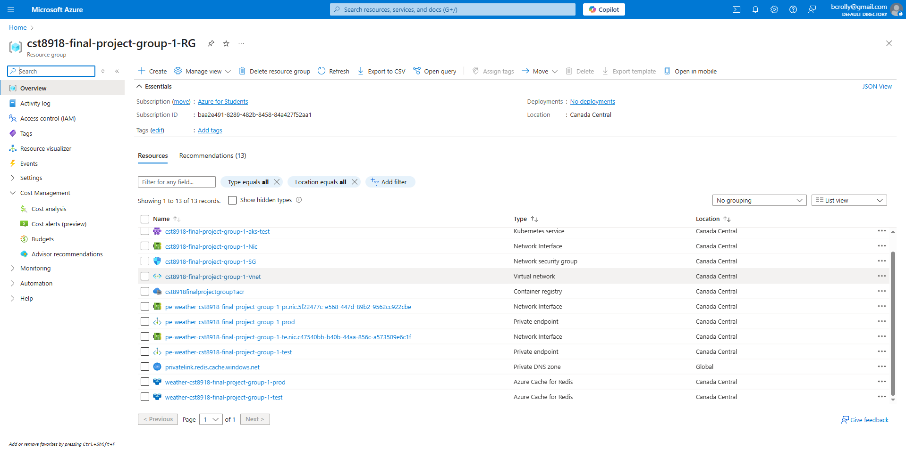
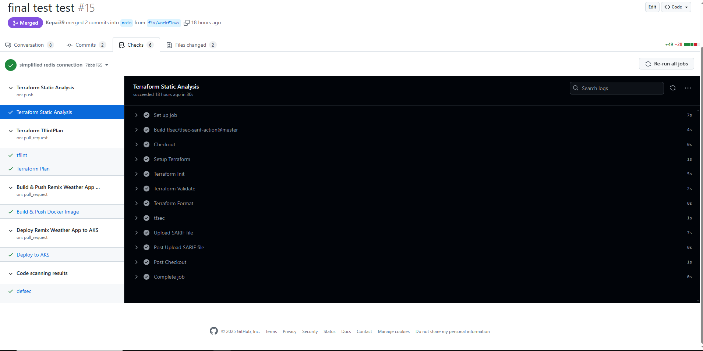
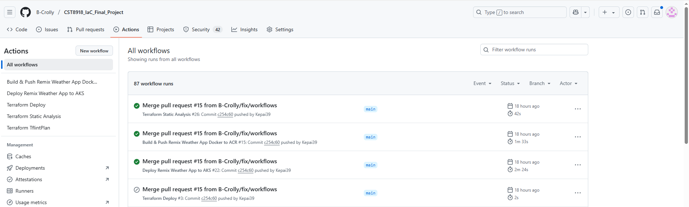
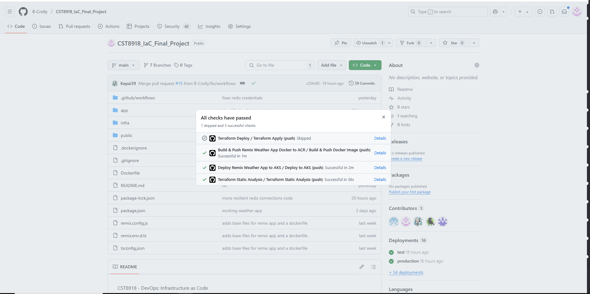
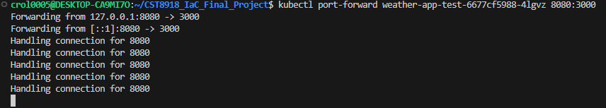
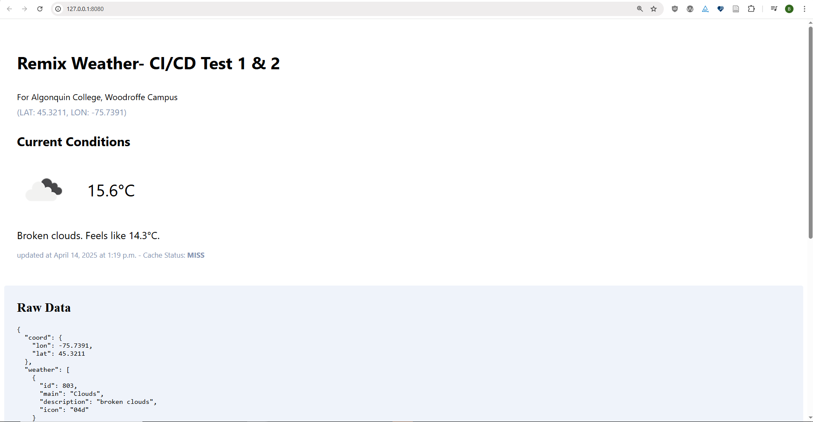
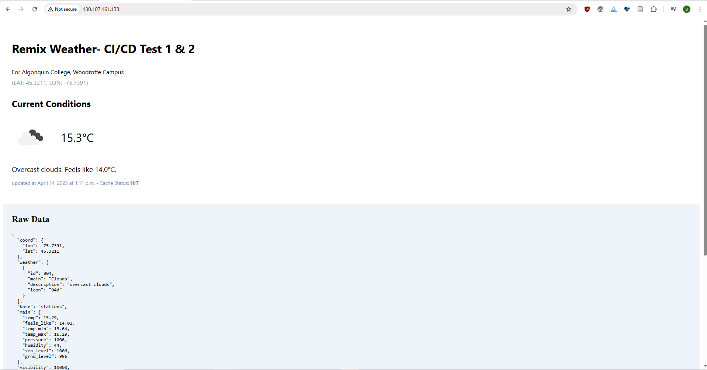

# CST8918 IaC Final Project - Weather Application

## Team Members
- [Bourne Crolly](https://github.com/B-Crolly)
- [Yiting (Tina) Yao](https://github.com/yitingyao)
- [Catherine Daigle](https://github.com/Kepai39)
- [Rae Ehret](https://github.com/ehre0004)

## Project Overview
This project implements a weather application using Infrastructure as Code (IaC) principles. The application is deployed on Azure Kubernetes Service (AKS) with both test and production environments.

### Infrastructure Components
- Azure Kubernetes Service (AKS) clusters
  - Test environment: 1 node
  - Production environment: 1-3 nodes (autoscaling)
- Azure Cache for Redis
- Azure Container Registry (ACR)
- Virtual Network with multiple subnets
- Azure Blob Storage for Terraform state

### Application Features
- Real-time weather data retrieval
- Caching using Redis
- Containerized deployment
- CI/CD pipeline with GitHub Actions

## Instructions

### Prerequisites
- Azure CLI
- kubectl
- Terraform
- Node.js and npm
- Docker and Docker Compose

### Local Development Setup
1. Clone the repository
2. Install dependencies:
   ```bash
   npm install
   ```
3. Create and configure .env file:
   ```bash
   # Create .env file
   touch .env
   
   # Add the following content to .env:
   WEATHER_API_KEY=your_openweather_api_key_here
   REDIS_URL=redis://localhost:6379
   PORT=3000
   ```
4. Start Redis container:
   ```bash
   # Pull the Redis image
   docker pull redis
   
   # Run Redis container
   docker run -d --name redis -p 6379:6379 redis
   
   # Verify Redis is running
   docker ps
   
   # Test Redis connection
   docker exec -it redis redis-cli ping
   # Should return "PONG"
   ```
5. Run the application locally:
   ```bash
   npm run dev
   ```

### Infrastructure Deployment
1. Navigate to the infrastructure directory:
   ```bash
   cd infra/tf-app
   ```
2. Initialize Terraform:
   ```bash
   terraform init
   ```
3. Apply the configuration:
   ```bash
   terraform apply
   ```

### Accessing Test Environment
Due to limited public IP availability for student projects, the test environment requires port forwarding to access:
```bash
# Get the test pod name
kubectl get pods
# Forward local port 8080 to pod port 3000
kubectl port-forward <test-pod-name> 8080:3000
```
Then access the application at http://localhost:8080

## Deployment Workflow
The application is automatically deployed through GitHub Actions workflows:

1. **On Pull Request to Main**:
   - Runs static code analysis (fmt, validate, tfsec)
   - Runs tflint and terraform plan
   - Builds and pushes Docker image to ACR
   - Deploys to test environment

2. **On Merge to Main**:
   - Runs terraform apply for infrastructure changes
   - Deploys to production environment
   - Production Redis is automatically provisioned through Terraform
   - Application connects to production Redis using connection string from Kubernetes secrets

## Screenshots

Infrastructure deployed to azure:


succesfull workflows applied during Pull request (deploying only to test)


Workflows completing on main (deploying to prod)



app running in test (using kubectl port forwarding)



app running in prod
